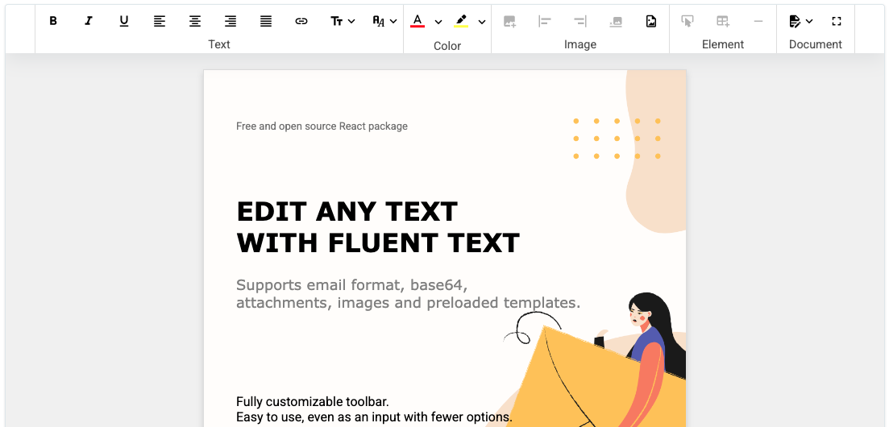

<div align="center">

# FluentText


**A modern, feature-rich rich text editor component for React**


[Features](#features) • [Installation](#installation) • [Quick Start](#quick-start) • [Documentation](#documentation)

</div>




## Overview

FluentText is a powerful, customizable rich text editor built for React applications. It provides a comprehensive set of editing tools including text formatting, image insertion, color management, layout options, and template support. Perfect for email editors, content management systems, and any application requiring rich text editing capabilities.

## Features

✨ **Rich Text Editing**
- Full text formatting (bold, italic, underline, strikethrough)
- Font family and size customization
- Text alignment (left, center, right, justify)
- Link insertion and management
- Variable insertion for dynamic content

🎨 **Visual Customization**
- Color picker for text and background colors
- Background image support
- Customizable toolbar layout (horizontal/vertical)
- Responsive design support
- Email-optimized HTML output

📎 **Advanced Features**
- Image insertion and management
- File attachments support
- Template system for reusable content
- Variable system for dynamic placeholders
- Base64 content encoding/decoding

🌍 **Internationalization**
- Built-in support for English and French

⚙️ **Developer Experience**
- Fully typed with TypeScript
- Highly customizable via props
- Debounced content change callbacks
- Disabled state support
- Minified output option

## Installation

```bash
npm install fluent-text
# or
yarn add fluent-text
# or
pnpm add fluent-text
```

### Peer Dependencies

FluentText requires React 18+ and React DOM 18+:

```bash
npm install react react-dom
```

## Quick Start

```tsx
import React from 'react';
import { FluentText } from 'fluent-text';

function App() {
  const handleContentChange = (htmlContent: string, base64Content: string) => {
    console.log('HTML:', htmlContent);
    console.log('Base64:', base64Content);
  };

  return (
    <FluentText
      onContentChange={handleContentChange}
      height={500}
    />
  );
}

export default App;
```

## Documentation

### Types and props

Details types and props: 
- [Types](TypesAndProps.md#Types)
- [Props](TypesAndProps.md#Props)

You can also test it live with (FluentText's Storybook)[sqd].

## Internationalization

FluentText supports multiple languages out of the box:

- English (`'en'`) - Default
- French (`'fr'`)

## Browser Support

FluentText works in all modern browsers that support:
- React 18+
- ContentEditable API
- CSS Grid and Flexbox

## License

This project is licensed under the MIT License - see the [LICENSE](LICENSE) file for details.

## Support

- 📖 [Documentation](https://github.com/SachaMarits/fluent-text#readme)
- 🐛 [Report a Bug](https://github.com/SachaMarits/fluent-text/issues)

## Acknowledgments

Built with ❤️ using React, TypeScript, and modern web technologies.

---

<div align="center">

Made with FluentText

[⬆ Back to Top](#fluenttext)

</div>

